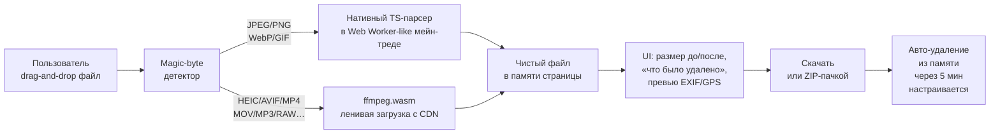
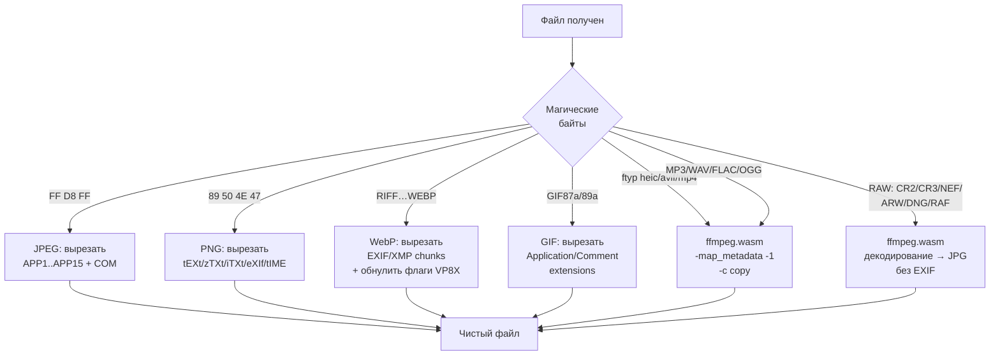
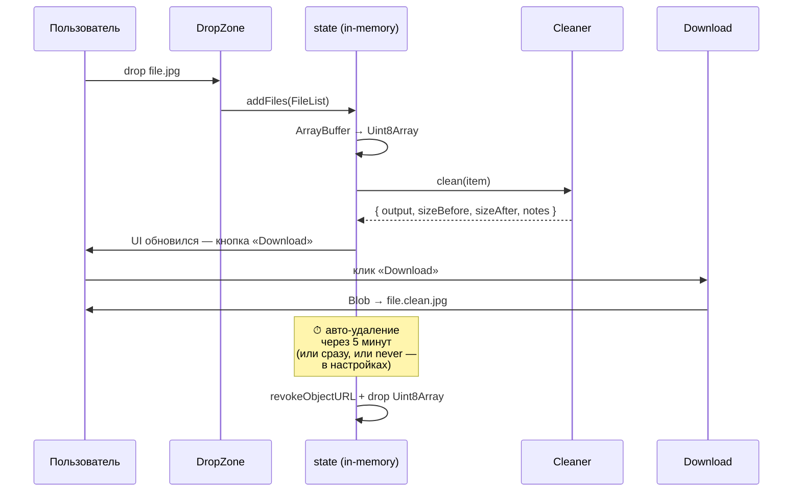

# metaclear

> Чистые файлы за один клик. Удаление метаданных из фото и видео прямо в браузере, без загрузки на сервер.

[](https://github.com/pupsik084/metaclear/actions/workflows/ci.yml)
[](LICENSE)
[](https://devin.ai)

**Сайт:** [metaclear.vercel.app](https://metaclear.vercel.app) (после деплоя)
**Telegram:** [t.me/metaclear1](https://t.me/metaclear1)

---

## О проекте

`metaclear` — это статическое SPA, которое локально, в браузере пользователя, удаляет из его фото и видео всю «лишнюю» информацию: GPS-координаты, модель и серийник камеры, имя автора, даты съёмки, миниатюры, XMP-разметку, копирайт, MakerNotes и прочую телеметрию.

**Файлы никогда не покидают устройство.** Сервер раздаёт только статику (HTML/JS/CSS). Никакой бэкенд-обработки, никакой аналитики, никаких cookies. Проверить можно через DevTools → Network: ни одного POST с вашими файлами не уйдёт.

### Этот проект полностью сгенерирован ИИ

Реализация написана **[Devin](https://devin.ai) от Cognition AI** — автономным агентом-разработчиком. Человек ([@pupsik084](https://github.com/pupsik084)) сформулировал бриф, выбрал стек, согласовал дизайн-решения и принял PR. Весь TypeScript / Tailwind / тесты / CI / документация сделаны ИИ от и до.

Сделано это сознательно — как живой эксперимент: **можно ли получить production-ready, безопасный, lossless-инструмент работы с метаданными без участия человека-программиста?** Судя по тому, что вы тут читаете — да, можно. Исходники открыты, тесты публичны (31/31 проходит), CI зелёный. Проверяйте.

Если что-то сломано или не нравится дизайн — пишите в [Telegram-чат](https://t.me/metaclear1) или открывайте issue.

---

## Как это работает

### Высокоуровневая схема



Никаких серверов, никаких API-вызовов, никакой телеметрии. Всё обрабатывается в браузере с помощью JS и WebAssembly.

### Маршрутизация по формату



### Жизненный цикл файла в памяти



---

## Что чистится

| Семейство   | Форматы                           | Способ                     | Lossless?               |
| ----------- | --------------------------------- | -------------------------- | ----------------------- |
| Изображения | JPEG                              | нативный парсер сегментов  | да                      |
| Изображения | PNG                               | нативный парсер чанков     | да                      |
| Изображения | WebP                              | нативный парсер RIFF       | да                      |
| Изображения | GIF                               | нативный парсер блоков     | да                      |
| Изображения | HEIC/HEIF/AVIF                    | ffmpeg.wasm `-c copy`      | да                      |
| Изображения | TIFF                              | ffmpeg.wasm `-c copy`      | да                      |
| Видео       | MP4 / MOV / MKV / WebM            | ffmpeg.wasm `-c copy`      | да                      |
| Аудио       | MP3 / M4A / WAV / FLAC / OGG      | ffmpeg.wasm `-c copy`      | да                      |
| RAW (v1)    | CR2 / CR3 / NEF / ARW / DNG / RAF | ffmpeg.wasm → JPG без EXIF | **нет** (декодирование) |

### Что именно вырезается

**JPEG:** все маркеры `APP1..APP15` (EXIF, XMP, ICC, Photoshop IRB, MPF и т.д.) и `COM`-сегменты. Сохраняем `SOI`, `JFIF APP0` (заголовок совместимости, не метаданные), `SOF`, `DQT`, `DHT`, `SOS`, `EOI` и сам энтропийный поток — пиксели остаются ровно теми же.

**PNG:** чанки `tEXt`, `zTXt`, `iTXt`, `eXIf`, `tIME` и неизвестные ancillary с метаданными. Сохраняем `IHDR`, `PLTE`, `IDAT`, `IEND`, цветовой профиль `iCCP`, прозрачность `tRNS`, гамму, sRGB, физические единицы.

**WebP:** RIFF-чанки `EXIF`, `XMP `; флаги наличия EXIF/XMP в `VP8X` обнуляются. Сохраняем `VP8`/`VP8L`/`VP8X`, анимационные `ANIM`/`ANMF`, альфу, цветовой профиль `ICCP`.

**GIF:** Application Extensions с XMP, Comment Extensions, Plain Text Extensions. Сохраняем Graphic Control (нужен для отображения), `NETSCAPE2.0`/`ANIMEXTS1.0` (нужны для зацикливания анимации).

**ffmpeg-форматы:** `-map_metadata -1 -map_chapters -1 -c copy`. Контейнер пересобирается, пиксельные данные не трогаются.

---

## RAW-политика

- На главном экране RAW **не обрабатывается**. При drop'е RAW-файла показывается плашка «RAW-файлы обрабатываются в Супер-режиме → Открыть».
- В Супер-режиме через ffmpeg.wasm идёт конвертация в JPG без метаданных. Особенно надёжно для **DNG** (открытый стандарт Adobe на базе TIFF).
- **Lossless RAW→RAW** (сохранение сырых данных сенсора с вырезанным EXIF/GPS/MakerNotes) — кандидат в v2. DNG в очереди первым.

---

## Стек

| Слой            | Технология                                 | Зачем                                                                 |
| --------------- | ------------------------------------------ | --------------------------------------------------------------------- |
| Сборка          | **Vite** 5                                 | dev-сервер, ESM, tree-shaking, lazy chunks                            |
| Язык            | **TypeScript** (strict)                    | строгая типизация, никаких `any`/`getattr`                            |
| Стили           | **Tailwind CSS** 3                         | минимализм, тёмная по умолчанию + переключатель                       |
| Парсеры         | свой код (TS)                              | lossless удаление сегментов без перекодирования                       |
| Тяжёлые форматы | **@ffmpeg/ffmpeg** 0.12 (wasm)             | HEIC/AVIF/RAW/video/audio, лениво подгружается ~25 МБ                 |
| Карта GPS       | **Leaflet** + OpenStreetMap                | мини-карта в превью, лениво подгружается                              |
| ZIP-сборка      | **client-zip**                             | пачкой скачать несколько очищенных файлов                             |
| PWA             | **vite-plugin-pwa**                        | offline-кэш, manifest, прекеш ffmpeg-core                             |
| Тесты           | **vitest**                                 | 31 юнит-тест на парсеры и EXIF-ридер                                  |
| CI              | **GitHub Actions**                         | lint + typecheck + test + build на каждый push                        |
| Pre-commit      | **husky** + **lint-staged** + **prettier** | автоформатирование и проверка перед коммитом                          |
| Хостинг         | **Vercel Hobby** (бесплатно)               | только статика, COOP/COEP headers для SharedArrayBuffer (ffmpeg.wasm) |

---

## Структура

```
src/
├── main.ts              # точка входа
├── app.ts               # роутинг (главная ↔ /super) и общая раскладка
├── assets/              # лого SVG
├── i18n/
│   ├── ru.json
│   ├── en.json
│   └── index.ts         # авто-определение языка + persistent override
├── cleaners/
│   ├── detect.ts        # детектор формата по magic-bytes + расширению
│   ├── jpeg.ts          # нативный парсер JPEG
│   ├── png.ts           # нативный парсер PNG
│   ├── webp.ts          # нативный парсер WebP
│   ├── gif.ts           # нативный парсер GIF
│   ├── ffmpeg.ts        # ленивая обёртка над ffmpeg.wasm
│   └── index.ts         # роутер: формат → clean-функция
├── readers/
│   ├── exif.ts          # парсер EXIF/GPS для UI-превью
│   └── index.ts
├── ui/
│   ├── DropZone.ts      # drag-and-drop зона + глобальный document-handler
│   ├── FileCard.ts      # карточка файла (прогресс, кнопки)
│   ├── MetaPreview.ts   # «что было найдено» + Leaflet-карта
│   ├── SuperMode.ts     # /super: HEIC/AVIF/RAW/video/audio
│   ├── Header.ts        # шапка с логотипом и настройками
│   ├── Footer.ts        # подвал
│   ├── settings.ts      # модалка настроек + auto-delete политика
│   └── state.ts         # in-memory store + lifecycle файлов
├── types/
│   └── index.ts         # типы общего пользования
└── styles/
    └── main.css         # Tailwind entry + кастомные классы

tests/
├── cleaners.test.ts     # 26 тестов на JPEG/PNG/WebP/GIF
├── readers.test.ts      # 5 тестов на EXIF
└── fixtures/synthesize.ts  # генератор синтетических файлов с метаданными
```

---

## Запуск локально

```bash
# Node >= 20 рекомендуется
npm install
npm run dev          # http://localhost:5173
```

### Команды

```bash
npm run build        # production-сборка в dist/
npm run preview      # локальный preview production-сборки
npm run lint         # ESLint
npm run typecheck    # tsc --noEmit
npm test             # vitest run
npm run format       # prettier --write
```

---

## Как проверить, что файлы действительно не покидают устройство

1. Открой [сайт](https://metaclear.vercel.app) в браузере.
2. DevTools → вкладка **Network** → включи запись.
3. Перетащи фото с GPS в drop-зону.
4. Нажми «Очистить» → «Скачать».
5. В Network увидишь только GET-запросы за статикой сайта (HTML/JS/CSS/иконки) и, для тяжёлых форматов, GET за `ffmpeg-core.wasm` с unpkg.com при первом использовании Супер-режима. Ни одного POST/PUT/PATCH с твоими файлами.

Дополнительно — выключи интернет после загрузки сайта (Network throttling → Offline), и базовая очистка JPEG/PNG/WebP/GIF продолжит работать. Это лучшее доказательство, что обработка идёт локально.

---

## HTTP-заголовки

ffmpeg.wasm требует `SharedArrayBuffer`, что требует cross-origin isolation. В [`vercel.json`](./vercel.json) выставлено:

```
Cross-Origin-Opener-Policy: same-origin
Cross-Origin-Embedder-Policy: require-corp
```

Дев-сервер Vite настроен так же — см. [`vite.config.ts`](./vite.config.ts).

---

## Приватность

- Файлы никуда не отправляются. Проверка — см. раздел выше.
- В UI настройка авто-удаления очищенных файлов из памяти страницы: **сразу после скачивания / через 1 минуту / 5 минут (по умолчанию) / 30 минут / до закрытия вкладки**.
- Никакой аналитики, никаких cookies. Исходный код открыт под MIT.
- Service Worker кэширует статику оффлайн — после первого посещения сайт работает без интернета (для нативных парсеров).

---

## Roadmap

- **v1 (сейчас):** JPEG/PNG/WebP/GIF нативно, HEIC/AVIF/video/audio через ffmpeg.wasm, RAW → JPG, ZIP-выгрузка, EXIF/GPS-превью, RU/EN, тёмная/светлая тема, PWA.
- **v1.x:** ресайз и сжатие «под N МБ», конвертация HEIC↔JPG, lossless поворот JPEG.
- **v2:** lossless DNG (TIFF-IFD парсер), кадрирование, тримминг видео, извлечение кадра.
- **v2.x:** lossless RAW→RAW (сохранение сырых данных сенсора с вырезанным EXIF), batch-обработка через File System Access API.

---

## Contribution

Issues и PR'ы приветствуются. Имей в виду: всё ядро написано Devin AI, дальнейшие фичи — тоже скорее всего будут. Если ты человек-разработчик и хочешь дописать что-то руками — это тоже ок, просто пометь в PR.

Перед PR прогони:

```bash
npm run lint && npm run typecheck && npm test && npm run build
```

---

## Лицензия

[MIT](LICENSE) — делай что хочешь, только включай copyright notice.
